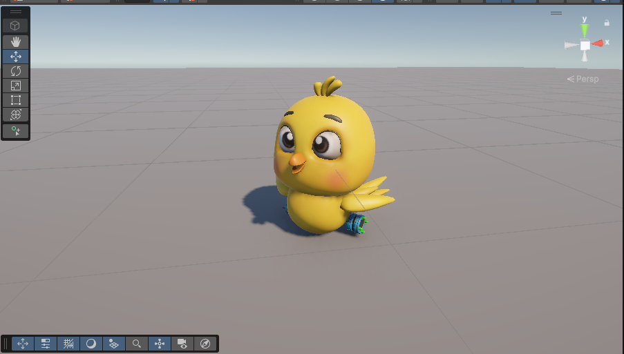

# 🐣 Chick Adventure

## 📌 Project Description

Chick Adventure is a **3D Unity game prototype** where the player controls a small chick exploring a stylized environment and collecting resources.

The project focuses on building core gameplay mechanics such as movement, interaction, and basic AI behavior. It is designed as a foundation for a fully playable game.

---

## 🎮 Current Features

- 🕹️ 3D player movement system
- ⬆️ Jump mechanic
- 🎨 3D character (chick) and environment setup
- ⚙️ Unity project structure with integrated tools (e.g. DOTween)

---

## 🧠 Planned Features

- 🐱 Enemy system (cat chasing the player)
- 🌾 Resource collection (wheat system)
- 🎯 Scoring & progression system
- 🔊 Sound effects and UI
- 🧩 Level design and game loop

---

## 📷 Current Build

  

---

## ⚙️ Technologies Used

- Unity (3D)
- C#
- DOTween (animation system)
- Unity Asset Store

---

## 🧪 Development Status

⚠️ This project is currently in **early development (Work in Progress)**.

The main goal at this stage is to implement and test **core gameplay mechanics** before expanding into a full game.

---

## 🚀 Future Plans

- Improve player physics and controls
- Implement enemy AI behavior
- Add interaction systems
- Expand environment and visuals
- Optimize performance

---

## 👨‍💻 Author

Developed as a personal Unity learning project focused on gameplay systems and 3D development.

---

## ⭐ Support

If you like this project, consider giving it a ⭐ on GitHub!
